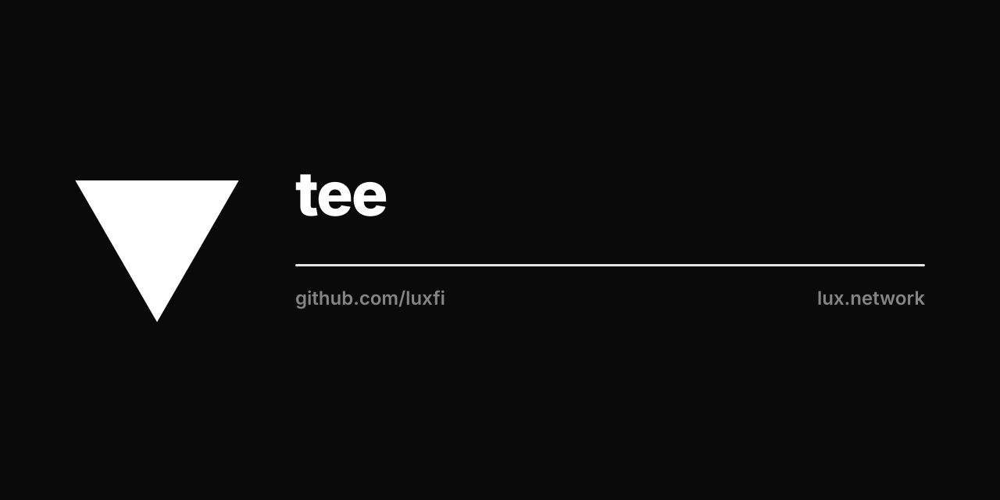

<p align="center"></p>

# luxfi/tee

Optional TEE-backed threshold-signing **custody** extension for the Lux
post-quantum signing stack. Deployments that want institutional,
attested-enclave custody of post-quantum signing keys integrate this
module. It is **not** required by the threshold core and is **not** used
on the permissionless / dealerless production signing path.

## Dependency direction (one-way)

```
luxfi/tee  ──►  luxfi/pulsar   (ML-DSA / FIPS 204 kernel)
           ──►  luxfi/corona   (Ring-LWE threshold kernel)
           ──►  luxfi/magnetar (SLH-DSA / FIPS 205 kernel)
           ──►  luxfi/mpc      (attestation · release-gate · HSM)
```

The cores never depend on `luxfi/tee`. The threshold core
(`luxfi/threshold`) builds with zero reference to this module; the
dealerless signing path (corona DKG, pulsar v0.3 algebraic-aggregate)
is the production default and carries no TEE dependency.

## Packages

| Package                          | Primitive                | Custody surface |
|----------------------------------|--------------------------|-----------------|
| `github.com/luxfi/tee/mldsa-tee` | ML-DSA-65 (FIPS 204)     | `Signer.Sign`   |
| `github.com/luxfi/tee/rlwe-tee`  | Corona Ring-LWE          | `Signer.Sign`   |
| `github.com/luxfi/tee/slhdsa-tee`| SLH-DSA (FIPS 205)       | `Signer.Sign` + `CombinerPool` (t-of-n attested combiners) |

Each `Signer` chains attestation evidence (SEV-SNP / TDX / NRAS) +
operator-asserted RIM + hardware fingerprint through the `luxfi/mpc`
release gate and HSM, then emits wire bytes that are byte-identical to
a single-party FIPS signature on the same `(key, message, ctx)` tuple —
verifiable by any independent verifier holding the published group key.

`slhdsa-tee.ChainSecurityProfile` (`ProfileStrictPQ` /
`ProfileLegacyCompat`) and the `ErrMagnetar*` sentinels express the
strict-PQ residency policy a deployment enforces when it wants every
SLH-DSA combine routed through an attested pool.

## Integration

There is exactly one way to TEE-sign: construct the per-scheme
`Signer` (`New(gate, hsm, approval, cfg)`), `Provision`, then call
`Signer.Sign(ctx, env, jobID, msg[, signCtx])`, or — for SLH-DSA
t-of-n — drive a `CombinerPool` (`AddMember` / `Attest` / `Combine`).

## Provenance

The `mldsa-tee`, `rlwe-tee`, and `slhdsa-tee` packages were extracted
verbatim from `github.com/luxfi/threshold/protocols/*` in 2026-06 to
decomplect optional TEE custody from the threshold core. Their full
end-to-end attestation test suites (against committed AMD Milan SEV-SNP
vectors) moved with them and pass in this module.
